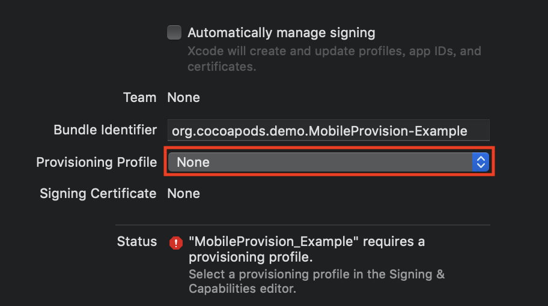
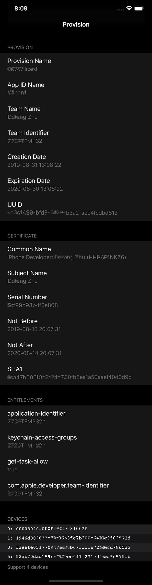

# MobileProvision

[](https://travis-ci.org/冷秋/MobileProvision)
[](https://cocoapods.org/pods/MobileProvision)
[](https://cocoapods.org/pods/MobileProvision)
[](https://cocoapods.org/pods/MobileProvision)

## Example

To run the example project, clone the repo, and run `pod install` from the Example directory first.

Open *Example/MobileProvision.xcworkspace* file with Xcode. Modify provision profile in Target - General:



Run the target (**MobileProvision_Example**) on your iOS device (**Do not on Simulator**).

Or run the target (**MobileProvisionCLI**) on your mac. (Modify the path in main.m)

## Requirements

## Installation

MobileProvision is available through [CocoaPods](https://cocoapods.org). To install
it, simply add the following line to your Podfile:

```ruby
pod 'MobileProvision' # for osx and ios
```

Import header:

```objc
#import <MobileProvision/MobileProvision.h>
```

## Usage

First: Create a `MPProvision` instance.

```objc
// for osx & ios
MPProvision *provision = [MPProvision provisionWithContentsOfFile:@"/path/to/*.mobileprovision"];

// for ios
MPProvision *provision = [MPProvision embeddedProvision]; // embedded.mobileprovision
```

Second: Read Information

```objc
(NSString *)provision.AppIDName;
(NSArray<NSString *> *)provision.ApplicationIdentifierPrefix;
(NSDate *)provision.CreationDate;
(NSDate *)provision.ExpirationDate;
(NSString *)provision.Name;
(NSArray<NSString *> *)provision.Platform;
(BOOL)provision.ProvisionsAllDevices;
(NSArray<NSString *> *)provision.ProvisionedDevices;
(NSArray<NSString *> *)provision.TeamIdentifier;
(NSString *)provision.TeamName;
(NSUInteger )provision.TimeToLive;
(NSString *)provision.UUID;
(NSUInteger)provision.Version;
```

Third: Read Entitlements

```objc
MPEntitlements *entitlements = provision.Entitlements;
(NSDictionary *)entitlements.JSON;
```

Last: Read Certificates

```objc
MPCertificate *certificate = provision.DeveloperCertificates.firstObject;

(NSInteger )certificate.version;
(NSString *)certificate.name;
(NSString *)certificate.serialNumber;
(NSDate *)certificate.validity.notBefore;
(NSDate *)certificate.validity.notAfter;

//	Developer
(NSString *)certificate.subject.name;
(NSString *)certificate.subject.unitName;
(NSString *)certificate.subject.commonName;
(NSString *)certificate.subject.countryName;

//	Apple Inc
(NSString *)certificate.issuer.name;
(NSString *)certificate.issuer.unitName;
(NSString *)certificate.issuer.commonName;
(NSString *)certificate.issuer.countryName;

(NSData *)certificate.signature;

//	Hash
// SHA1 can be used by codesign CLI to sign an App.
// It equals to the id in `$ security find-identity -p codesigning`
(NSString *)certificate.fingerprints.SHA1;
(NSString *)certificate.fingerprints.SHA256;
```

## Previews



## Author

冷秋, 516563564@qq.com

## License

MobileProvision is available under the MIT license. See the LICENSE file for more info.
